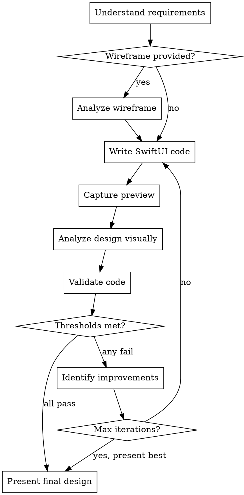

# SwiftUI Designer

## Overview

Design and iterate on SwiftUI interfaces autonomously. Write code, capture visual previews, analyze quality, validate against best practices, and iterate until quality thresholds are met. **Core principle:** Never ship a SwiftUI view you haven't visually verified and validated.

## When to Use

- Creating new SwiftUI views from descriptions
- Improving existing SwiftUI views
- Implementing designs from wireframe/mockup images
- Validating SwiftUI code for accessibility, performance, and best practices
- Iterating on UI design quality

**When NOT to use:**
- UIKit or AppKit-only interfaces
- Non-macOS environments (preview CLI requires macOS 14+)
- Pure logic/model code with no UI

## Prerequisites

The Swift preview CLI is bundled in this skill's directory. Build it on first use:

```bash
SKILL_DIR="$HOME/.claude/skills/swiftui-designer"
CLI_BIN="$SKILL_DIR/swift-cli/.build/release/swiftui-preview"

# Build if not already built
if [ ! -f "$CLI_BIN" ]; then
  cd "$SKILL_DIR/swift-cli" && swift build -c release
fi
```

Then use `$CLI_BIN` (or `$HOME/.claude/skills/swiftui-designer/swift-cli/.build/release/swiftui-preview`) as the command path when capturing previews.

If the build fails (missing Xcode, wrong macOS version), you can still do everything except visual preview capture — validation, code writing, and wireframe analysis all work without it.

## Design Workflow



## Quality Thresholds

Stop iterating when ALL of these pass (or max 5 iterations reached):

| Criterion | Threshold | What It Measures |
|-----------|-----------|------------------|
| Overall score | >= 7/10 | Visual hierarchy, aesthetics, layout |
| Accessibility | >= 8/10 | Labels, contrast, touch targets, Dynamic Type |
| Confidence | >= 0.8 | How certain the analysis is |
| Critical issues | 0 | No severity=error validation issues |

**Priority order when thresholds fail:**
1. Critical validation issues (errors) - fix immediately
2. Accessibility below threshold - fix before aesthetics
3. Overall quality below threshold - focus on lowest-scoring areas
4. Confidence below threshold - improve visual hierarchy and aesthetics
5. Many warnings (>3) - consider one more iteration if under max

## Capturing Visual Previews

Use the bundled Swift CLI to render SwiftUI views to PNG without a simulator:

```bash
~/.claude/skills/swiftui-designer/swift-cli/.build/release/swiftui-preview \
  --view-file /path/to/View.swift \
  --view-name MyView \
  --output /tmp/preview.png \
  --scale 2 \
  --state '{"@State": {"isLoading": false}, "@Binding": {"isPresented": true}}' \
  --width 390 --height 844
```

**State injection format:**
```json
{
  "@State": { "propertyName": value },
  "@Binding": { "propertyName": value },
  "@Environment": { "colorScheme": "dark" },
  "frame": { "width": 390, "height": 844 }
}
```

The CLI compiles a wrapper around the view, injects state, and renders via `ImageRenderer`. No simulator or Xcode project needed for standalone views.

After capturing, read the PNG image to visually analyze it.

## Analyzing Designs Visually

After capturing a preview, analyze it by reading the screenshot and evaluating these criteria:

**Score each 1-10:**
- **Visual hierarchy** - Clear importance levels, focal points
- **Color contrast** - WCAG compliance (4.5:1 for text)
- **Typography** - Consistent, readable, proper scale
- **Spacing/alignment** - Consistent padding, aligned elements
- **Accessibility** - Labels, touch targets, Dynamic Type support
- **Overall aesthetics** - Cohesive, polished, intentional

**Also assess:**
- Confidence (0.0-1.0) in the analysis
- Top 3 specific, actionable improvements
- Positive observations to preserve

## Validating SwiftUI Code

Perform static analysis on Swift files. Check for these issues:

### Accessibility Checks
| Issue | Severity | Fix |
|-------|----------|-----|
| `Image(` without `.accessibilityLabel()` or `.accessibilityHidden(true)` | warning | Add label or mark decorative |
| `Button(action:` without `.accessibilityHint` | info | Add hint for complex actions |
| `.font(.system(size: N))` where N < 12 | warning | Use Dynamic Type: `.font(.body)` |
| `.foregroundColor(.gray)` / `.foregroundStyle(.gray)` | info | Verify WCAG 4.5:1 contrast |
| `.frame(width/height: N)` where N < 44 on interactive elements | warning | Min 44x44pt touch targets (Apple HIG) |

### Performance Checks
| Issue | Severity | Fix |
|-------|----------|-----|
| `DateFormatter()` in view body | warning | Move to static property |
| `.sorted(` / `.filter(` in body | info | Cache in @State or compute in onAppear |
| Multiple `.onAppear` (>2) | info | Consolidate or use `.task` |
| `ForEach(` without `id:` | warning | Add `id: \.self` or conform to Identifiable |
| `NavigationLink(destination:` (eager eval) | info | Use `NavigationLink(value:` for lazy loading |

### Best Practice Checks
| Issue | Severity | Fix |
|-------|----------|-----|
| `@ObservedObject var x = Foo()` (inline init) | **error** | Use `@StateObject` for owned objects |
| `AnyView(` | warning | Use `@ViewBuilder`, `Group`, or `some View` |
| Top-level `GeometryReader` | info | Wrap in container, use only where needed |
| Force unwrapping (non-Environment) | warning | Use if-let or nil-coalescing |
| Lines > 120 chars | info | Break for readability |
| Magic numbers in `.padding(NN)` | info | Extract to constants/design system |

## Analyzing Wireframes

When a wireframe/mockup image is provided, analyze it to extract:

1. **Components** - Every UI element (Button, Text, Image, List, etc.)
2. **Layout structure** - VStack/HStack/ZStack hierarchy
3. **View decomposition** - How to split into reusable sub-views
4. **Colors** - Extract hex palette (primary, secondary, background, accent)
5. **Typography** - Map sizes to semantic SwiftUI fonts (.title, .body, .caption)
6. **Interactive elements** - Buttons, toggles, text fields and their behaviors
7. **Data requirements** - Properties the view needs (name: String, items: [Item], etc.)

## SwiftUI Design Principles

Follow these when writing code:

### Accessibility First
- Every `Image` needs `.accessibilityLabel()` or `.accessibilityHidden(true)` for decorative
- Minimum 44x44pt touch targets
- Color contrast >= 4.5:1 for text
- Use Dynamic Type (`.font(.title)`, `.font(.body)`) not fixed sizes
- Support VoiceOver with meaningful labels

### SwiftUI Native
- Prefer built-in components over custom
- Use semantic fonts (`.title`, `.body`, `.headline`) not `.system(size:)`
- Leverage layout system: VStack, HStack, LazyVGrid, List
- Use `@StateObject` for owned objects, `@ObservedObject` for injected
- Prefer `NavigationLink(value:)` over `NavigationLink(destination:)`

### Performance
- Never create `DateFormatter`/`NumberFormatter` in view body
- Don't sort/filter arrays in body - cache results
- Add explicit `id:` to `ForEach`
- Keep view bodies < 50 lines
- Extract reusable sub-views

### Code Style
- Meaningful names for views and properties
- Group related modifiers together
- Extract reusable components
- No force unwrapping
- No `AnyView` - use `@ViewBuilder` or `some View`
- Named constants for spacing/sizing (design system)

## Presenting Final Results

When quality thresholds are met, present:

1. **Complete SwiftUI code** - Ready to use
2. **Key design decisions** - Why specific patterns/layouts were chosen
3. **Remaining considerations** - Edge cases, accessibility notes, enhancement ideas
4. **Scores** - Final overall score, accessibility score, confidence

## Common Mistakes

| Mistake | Fix |
|---------|-----|
| Skipping preview capture | Always capture and visually verify - code that looks right in your head may not render as expected |
| Ignoring accessibility score | Accessibility threshold (8/10) is intentionally higher than overall (7/10) - prioritize it |
| Using `.system(size:)` everywhere | Use semantic fonts for Dynamic Type support |
| `@ObservedObject var vm = ViewModel()` | This recreates the object every render - use `@StateObject` |
| Iterating forever | Max 5 iterations - present best result even if imperfect |
| Not validating after visual changes | Always re-validate code after modifying it |
| Fixing aesthetics before accessibility | Fix accessibility issues first - they're higher priority |

## Red Flags - STOP and Fix

- Code with `Image(` and no accessibility modifier within 5 lines
- `@ObservedObject` with `=` (inline initialization) - this is always an error
- Touch targets under 44pt on any interactive element
- Font sizes under 12pt
- View body over 50 lines - extract sub-views
- `AnyView` usage - find a better pattern
- No visual verification before presenting to user
