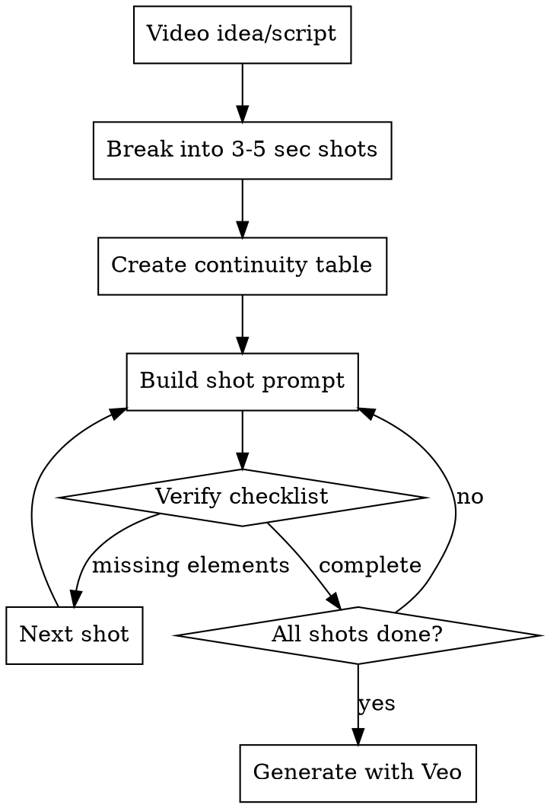

# Veo Video Prompting

## Overview

Convert video concepts into Veo 3.1 shot prompts that prevent hallucinations and maintain consistency. **Core principle:** Veo needs explicit instructions for everything - audio, spatial relationships, continuity, and technical specs. What you don't specify, Veo will hallucinate incorrectly.

## The Iron Law

**EVERY PROMPT MUST PASS THE ANTI-HALLUCINATION CHECKLIST.**

No exceptions:
- Not for "simple shots"
- Not for "time pressure"
- Not for "obvious audio"
- Not for "same object as before"
- Not for "smooth continuous takes"

Skipping checklist = hallucinations = wasted generations = MORE time lost.

## When to Use

- Converting video ideas/scripts into Veo prompts
- Creating multi-shot video sequences
- Experiencing Veo hallucinations (crowds, wrong audio, spatial drift)
- Character/object appearance changes between shots
- Spatial inconsistencies or exaggerated movements

**When NOT to use:**
- Single image generation
- Non-Veo video models (different prompting requirements)

## Core Workflow



## Shot Breakdown Strategy

**NEVER create single continuous prompts for >5 seconds.** Model state drifts.

| Video Length | Shot Structure |
|--------------|----------------|
| 10-15 sec | 3-4 shots (3-5 sec each) |
| 15-30 sec | 5-7 shots (3-5 sec each) |
| 30-60 sec | 10-15 shots (3-5 sec each) |

**Each shot = separate Veo generation.** Stitch in video editor.

## Prompt Structure Template

```
[SHOT TYPE], [ASPECT RATIO]. [PRIMARY SUBJECT with detailed description]. [ACTION].
[CAMERA MOVEMENT - be explicit about what moves]. [SETTING/ENVIRONMENT].
[LIGHTING - specific quality and direction]. [MOOD/STYLE].
[AUDIO: dialogue + background sounds]. [NEGATIVE: elements to avoid].
[DURATION] seconds.
```

### Example (Good):
```
Medium shot, 16:9. Alex, a woman with short black hair in a sleek bob,
wearing a bright red wool jacket, laughs and gestures with both hands.
Camera holds static on her face and upper body. Coffee shop interior
with large window behind her, wooden table with white ceramic cups visible.
Soft natural daylight from window left, warm interior lighting.
Friendly, candid atmosphere.
Audio: Alex's warm laughter, quiet background cafe chatter, gentle
clink of cups, soft indie music playing.
Negative: crowd, loud music, harsh lighting.
4 seconds.
```

## Continuity Table (Multi-Shot Essential)

Before writing prompts, create this table and copy-paste for each shot:

| Element | Details |
|---------|---------|
| **Character(s)** | Full description - NEVER shorten across shots |
| **Wardrobe** | Exact clothing items and colors |
| **Props** | Objects that must persist |
| **Location** | Setting details |
| **Lighting** | Direction, quality, time of day |
| **Weather/Atmosphere** | Fog, rain, dust, etc. |
| **Lens/Format** | Wide/medium/close, aspect ratio |
| **Color Grade** | Warm, cool, cinematic, etc. |
| **Reference Images** | Up to 3 per shot for character/object consistency |

**Critical:** Copy-paste character descriptions verbatim across shots. Don't shorten to "save space" - Veo needs full details every time.

## Anti-Hallucination Checklist

Check EVERY prompt has:

- [ ] **Audio specified explicitly** (dialogue + background sounds) - NO AUDIO = HALLUCINATED CROWDS
- [ ] **Camera movement clarity** (dolly forward vs subject moving toward camera - Veo can't distinguish)
- [ ] **Spatial relationships explicit** (object A is 3 feet left of object B)
- [ ] **Negative prompts** (format: "Negative: walls, frames, crowds" NOT "no walls")
- [ ] **Character descriptions verbatim** (if multi-shot with same character)
- [ ] **Technical specs** (shot type, aspect ratio, duration)
- [ ] **Lighting direction** (left, right, above, behind)
- [ ] **3-5 second duration** (not longer)

## Camera Movement Specifications

Veo understands these but you must be EXPLICIT:

| Movement | Description | Veo Prompt |
|----------|-------------|------------|
| Static | No camera movement | "Camera holds static/locked off" |
| Dolly | Camera moves forward/back on track | "Slow dolly forward along the path" |
| Tracking | Camera follows subject laterally | "Smooth tracking shot following the skater left to right" |
| Pan | Camera rotates left/right | "Slow pan from left to right across the forest" |
| Crane | Camera moves up/down | "Crane shot rising from ground level to bird's eye view" |
| POV | Camera is character's perspective | "POV shot from driver's perspective inside the car" |
| Aerial | Bird's eye view | "Aerial view looking straight down at the plaza" |

**Anti-pattern:** "Camera follows the action" - TOO VAGUE. Specify dolly/tracking/pan/crane.

## Character/Object Consistency

### Reference Images (Most Powerful)
- Use up to 3 reference images per shot
- Front-facing neutral portrait most reliable
- Keep base reference in set even when adding action references

### Prompt Consistency
```markdown
# ❌ BAD: Shortened description in shot 2
Shot 1: "Alex, woman with short black hair in bob, red jacket..."
Shot 2: "Alex laughs..."  # TOO SHORT - Veo will change appearance

# ✅ GOOD: Full description every time
Shot 1: "Alex, woman with short black hair in bob, red jacket..."
Shot 2: "Alex, woman with short black hair in bob, red jacket, laughs..."
Shot 3: "Alex, woman with short black hair in bob, red jacket, nods..."
```

### Unique Descriptions
More unique = better consistency. "Woman with red hair" (generic) vs "Woman with copper-red hair in messy bun with pencil stuck through it, wearing cat-eye glasses" (unique).

## Audio Design (Critical)

**NO AUDIO SPEC = HALLUCINATED CROWDS.** This is Veo's #1 hallucination problem.

Always include: `Audio: [dialogue if any] + [foreground sounds] + [background ambience]`

### Examples:
```
Coffee shop: "Audio: Quiet conversation, espresso machine hissing,
ceramic cups clinking, soft indie music, distant traffic outside"

Skateboard: "Audio: Skateboard wheels on concrete, hard landing impact,
distant city traffic, birds chirping, slight wind"

Forest: "Audio: Gentle wind rustling leaves, distant bird calls,
soft footsteps on moss, morning stillness"
```

## Common Mistakes

| Mistake | Why It Fails | Fix |
|---------|--------------|-----|
| "Veo will figure out audio" | Results in hallucinated crowds/wrong ambience | Specify dialogue + foreground + background sounds |
| Single 15-second prompt | Identity drift, quality degradation | Break into 3-5 shots, 3-5 sec each |
| "Camera follows smoothly" | Vague - could be dolly/tracking/pan | Use specific: "smooth tracking shot following subject" |
| Shortening character description in later shots | Appearance changes | Copy-paste full description every shot |
| "No crowds" in prompt | Veo ignores "no/don't" instructions | Use "Negative: crowds, audience, people" |
| Assuming spatial consistency | Veo has no world model - objects drift | Specify explicit spatial relationships |
| Omitting technical specs | Less control over output | Include shot type, aspect ratio, lens |
| Long continuous generation | State drift causes errors | Always 3-5 sec max per generation |
| "Simple shot doesn't need audio" | Simple shots hallucinate audio too | Every prompt needs audio, no exceptions |
| Time pressure skipping checklist | Bad prompts → re-work → MORE time wasted | Checklist takes 30 sec, saves hours |
| "Same object, already described" | Each generation is independent | Re-specify everything for each prompt |
| "20-second smooth take" | State drift ruins the shot | Break into 4-5 shots, stitch in editor |

## Red Flags - STOP and Revise Prompt

These thoughts mean your prompt will hallucinate:

- "The audio is obvious from context" → NO - specify explicitly
- "One prompt for the whole 20-second shot" → NO - break into 4-5 shots
- "I'll just say 'camera follows'" → NO - specify dolly/tracking/pan/crane
- "I already described Alex in shot 1" → NO - copy-paste full description
- "I'll say 'no crowds' to avoid them" → NO - use "Negative: crowds"
- "Veo understands this is indoors" → NO - spatial relationships drift
- "Just a simple shot, doesn't need all details" → NO - simple shots hallucinate too
- "Client meeting in 10 minutes, skip the checklist" → NO - bad prompts waste MORE time
- "It's straightforward, audio isn't needed" → NO - even simple shots need audio
- "Same object as before, don't need to re-describe" → NO - each prompt is independent
- "One smooth continuous take looks better" → NO - stitch short clips, drift is worse

**ALL of these mean: Follow the checklist. Every prompt. No exceptions.**

## Real-World Example

### Video Idea:
"Two friends having coffee, one tells a joke, both laugh"

### ❌ BAD (Single Prompt):
```
Two friends having animated conversation at coffee shop, laughing. 15 seconds.
```
**Problems:** No audio (hallucinated crowd), too long (drift), no character details (inconsistent), vague camera.

### ✅ GOOD (Multi-Shot with Continuity):

**Continuity Table:**
- **Alex:** Woman, short black hair in sleek bob, bright red wool jacket, white t-shirt
- **Sam:** Man, full brown beard, navy blue hoodie, black-rimmed glasses
- **Setting:** Coffee shop, wooden table, window with natural light left side
- **Props:** Two white ceramic coffee cups, small succulent plant
- **Lighting:** Soft natural daylight from left, warm interior ambient
- **Format:** 16:9, medium shots
- **Audio Base:** Quiet cafe chatter, soft indie music, espresso machine distant

**Shot 1 (4 sec):**
```
Medium shot, 16:9. Alex, woman with short black hair in sleek bob, wearing
bright red wool jacket over white t-shirt, leans forward with mischievous
smile, beginning to speak. Camera static, locked on her upper body and face.
Coffee shop interior, wooden table with white ceramic cups and small succulent.
Large window behind with soft natural daylight from left, warm interior lighting.
Casual, friendly atmosphere.
Audio: Alex's voice starting to speak, quiet background cafe chatter,
soft indie music, distant espresso machine.
Negative: crowds, loud music, harsh lighting.
4 seconds.
```

**Shot 2 (3 sec):**
```
Medium shot, 16:9. Sam, man with full brown beard and black-rimmed glasses,
wearing navy blue hoodie, starts smiling then breaks into laughter,
head tilting back slightly. Camera static, locked on his face and upper body.
Same coffee shop interior, wooden table visible. Soft natural daylight from
left, warm interior lighting. Joyful, candid moment.
Audio: Sam's genuine laughter building, Alex's voice finishing joke off-camera,
background cafe ambience, soft music.
Negative: crowds, audience, harsh lighting.
3 seconds.
```

**Shot 3 (4 sec):**
```
Medium shot, 16:9. Both visible - Alex, woman with short black hair in sleek bob,
wearing bright red wool jacket, laughs with her whole body, gesturing with both
hands. Sam, man with full brown beard and black-rimmed glasses in navy blue hoodie,
continues laughing, wiping eyes. Camera static, capturing both across the table.
Coffee shop interior, window behind Alex with natural light. Wooden table with
white cups between them. Soft natural daylight from left, warm atmosphere.
Warm, connected friendship moment.
Audio: Both laughing together, cups clinking as table shakes slightly,
background cafe chatter, soft indie music.
Negative: crowds, other people close, harsh lighting.
4 seconds.
```

**Result:** 11 seconds total, 3 separate generations, maintained character consistency, no hallucinations, stitch in editor.

## Technical Notes

- **Veo 3.1** (latest): Better character consistency, improved audio sync
- **Max generation:** Technically up to 60sec, but drift occurs after 5sec
- **Reference images:** Use Ingredients to Video feature
- **First/Last frame:** Use for shot transitions, but still specify full details in prompt
- **Iteration:** Start simple, add detail incrementally if needed

---

**Sources:**
Research synthesized from Google Cloud Veo documentation, DeepMind prompt guides, and community best practices (2026).
